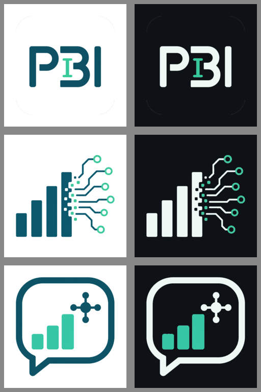
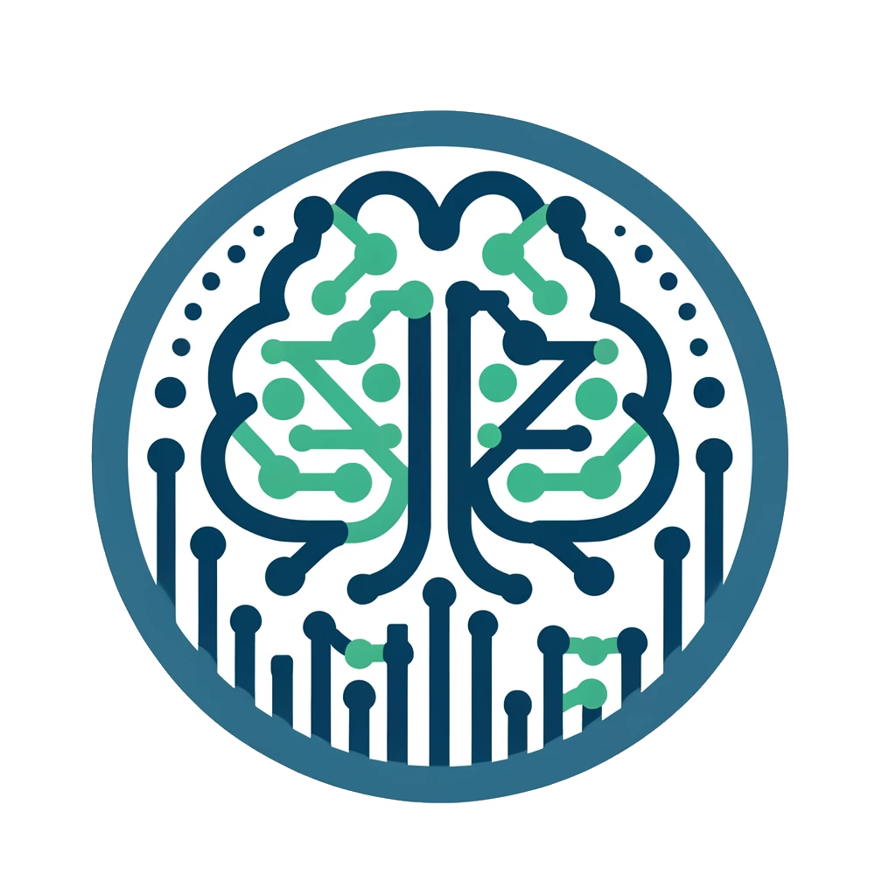
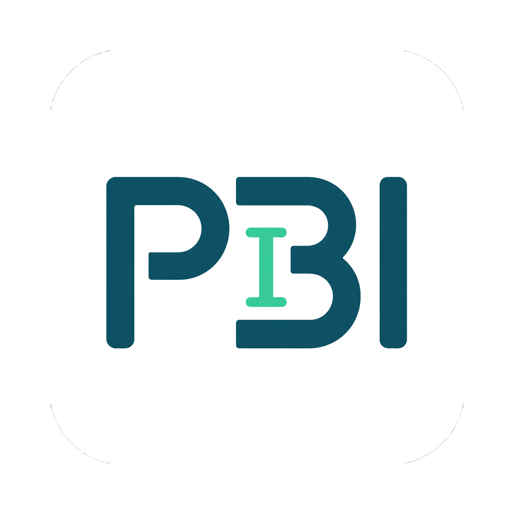
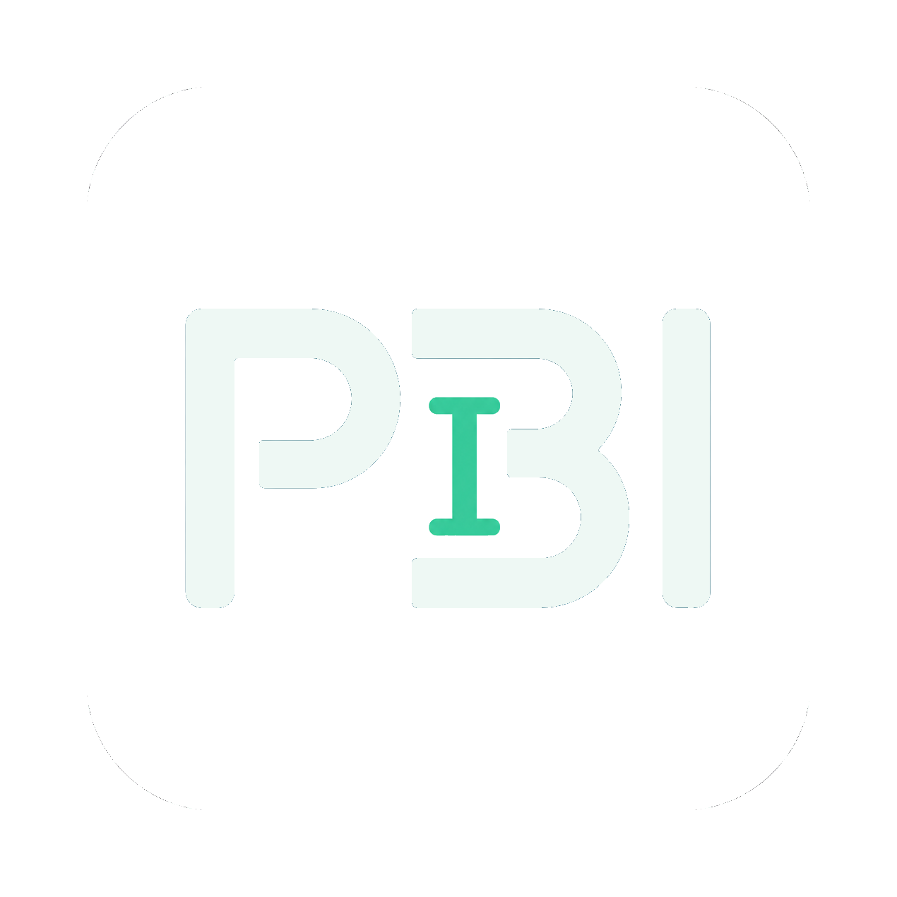
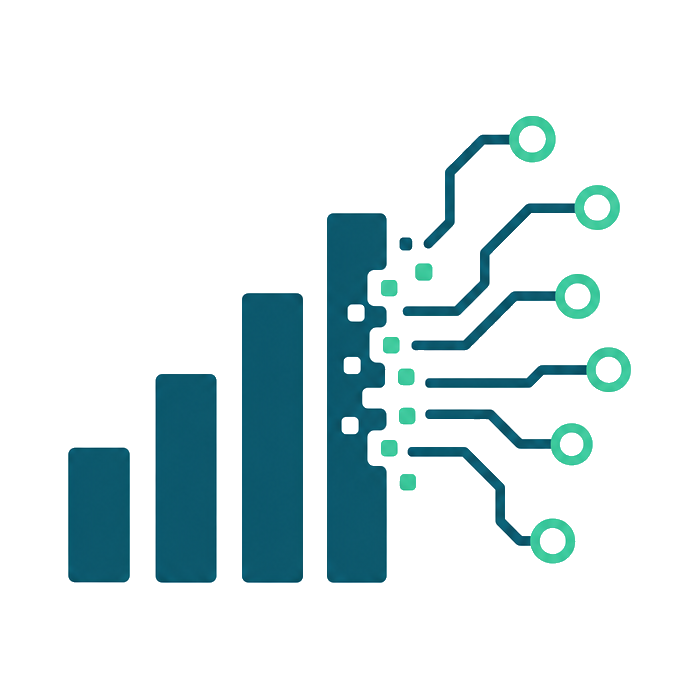
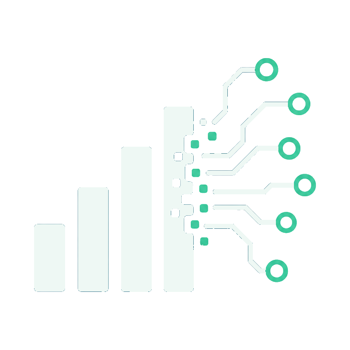
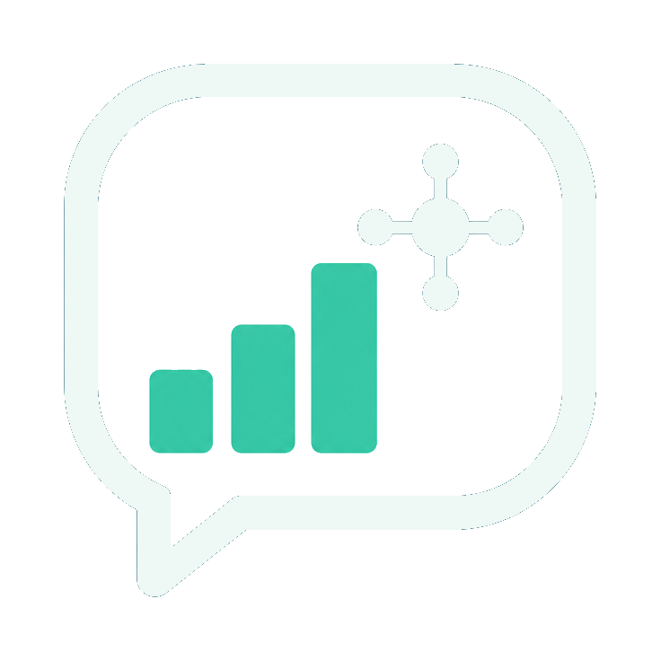

# Prompting BI — Logo Concepts

Private scratch folder. **Not** built or served by Astro (only `public/` ships to the site).
Open this file in Markdown preview to browse the options anytime.

## Quick comparison

Left = light (on white) · Right = dark (on near-black):

## What's in each concept folder

Every `alt-*` folder contains a full asset set, brand palette `#0c566b` navy + `#34c99a` green:

| File | Purpose |
| --- | --- |
| `source.png` | Original 1024² generation |
| `logo-light.png` | Icon, transparent bg — for light backgrounds |
| `logo-dark.png` | Same mark recolored (light strokes) — for dark backgrounds |
| `logo-light-full.png` / `logo-dark-full.png` | Includes wordmark where present (matters for alt-2) |
| `icon-512.png` | 512px app/OG icon |
| `favicon-32.png` / `favicon-16.png` | Light-mode favicons |
| `favicon-32-dark.png` / `favicon-16-dark.png` | Dark-mode favicons |
| `favicon.ico` | 48px multi-use icon |
| `apple-touch-icon.png` | 180px, **white-backed** (iOS renders transparency as black) |

---

## Currently in use (`current/`)

Brain-circuit badge. Light = transparent corners + white circle; dark = teal/light strokes.

| Light | Dark |
| --- | --- |
|  |  |

## 1 — PBI monogram (`alt-1-monogram/`)

| Light | Dark |
| --- | --- |
|  |  |

Cleanest at 16–32px, most brand-able. Weakest at signaling *what* the site is.

## 2 — Bars → circuit (`alt-2-bars-to-circuit/`)

| Light (icon) | Dark (icon) |
| --- | --- |
|  |  |

Best story: data (bars) becoming intelligence (circuit). Favicons use the icon-only crop; `*-full.png` keeps the "Prompting BI" wordmark for headers.

## 3 — Chat bubble + chart (`alt-3-chat-chart/`)

| Light | Dark |
| --- | --- |
|  |  |

Nails "prompting + BI" fusion, friendly tone.

---

## Notes / TODO
- All files are AI-generated **raster** PNGs. Whichever wins, get a **vector (SVG)** — dark version becomes a trivial CSS recolor instead of a separate file, and icons stay crisp at every size.
- To adopt one: copy that folder's `favicon-*`, `apple-touch-icon.png` into `public/`, and its `logo-light.png` / `logo-dark.png` into `public/images/brand/`, then update the `<link rel="icon">` set + header `<picture>` in `src/layouts/Base.astro`.
