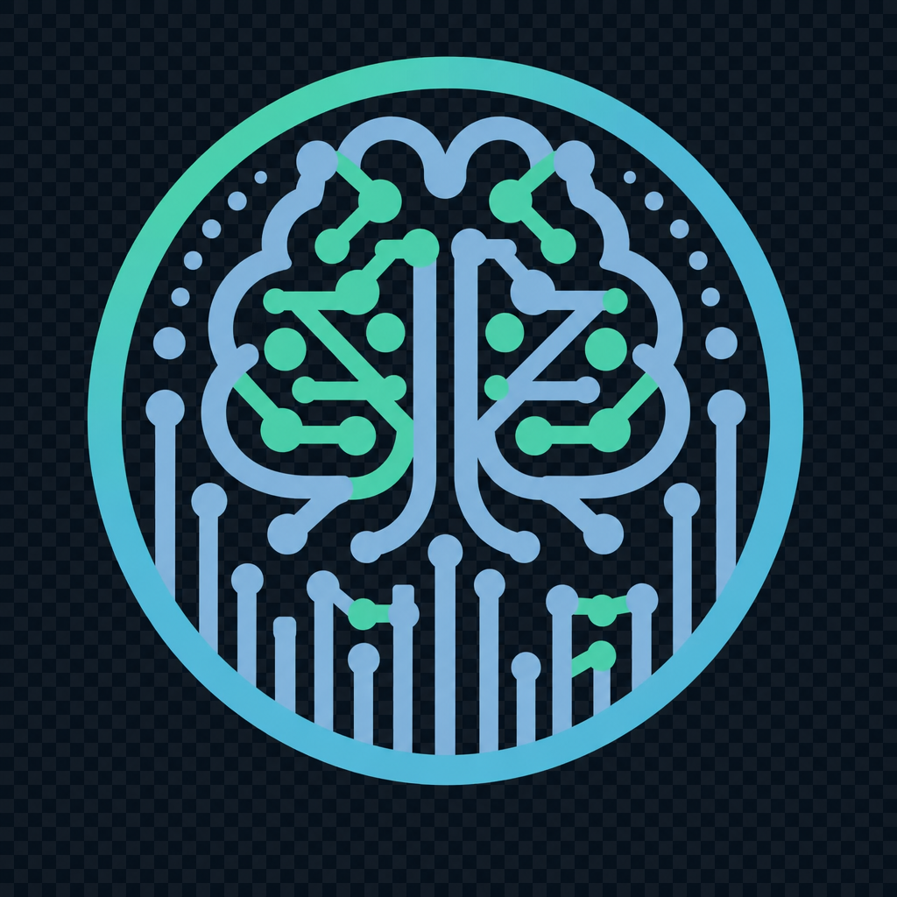
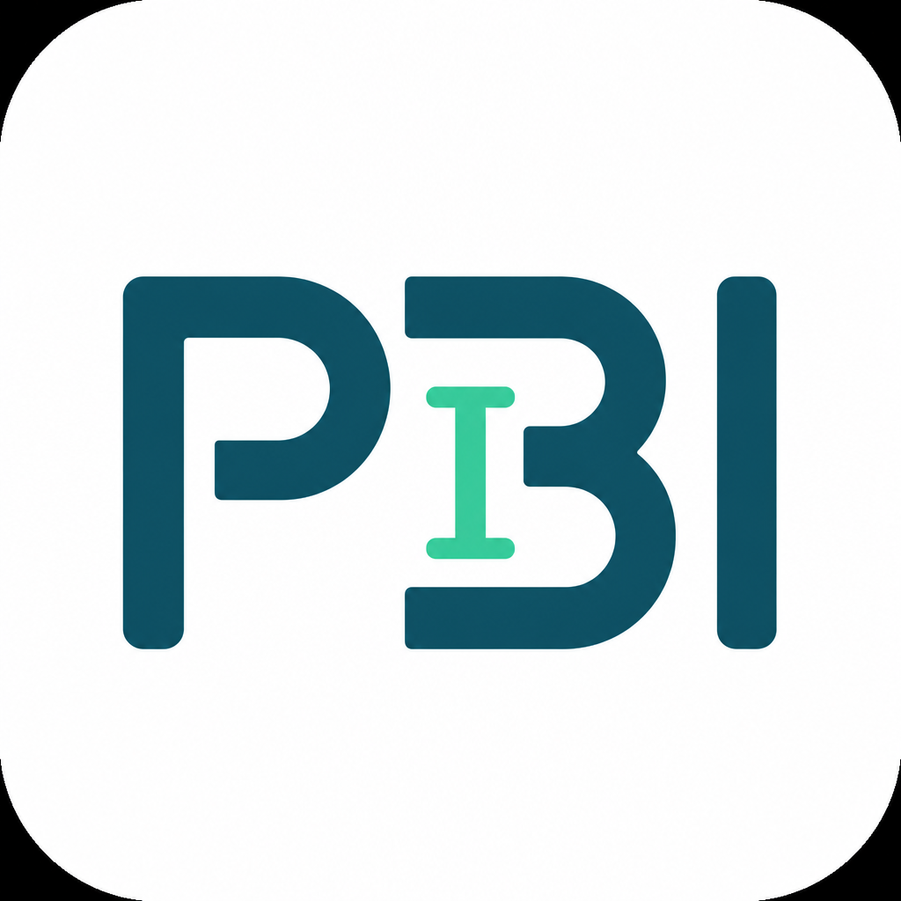
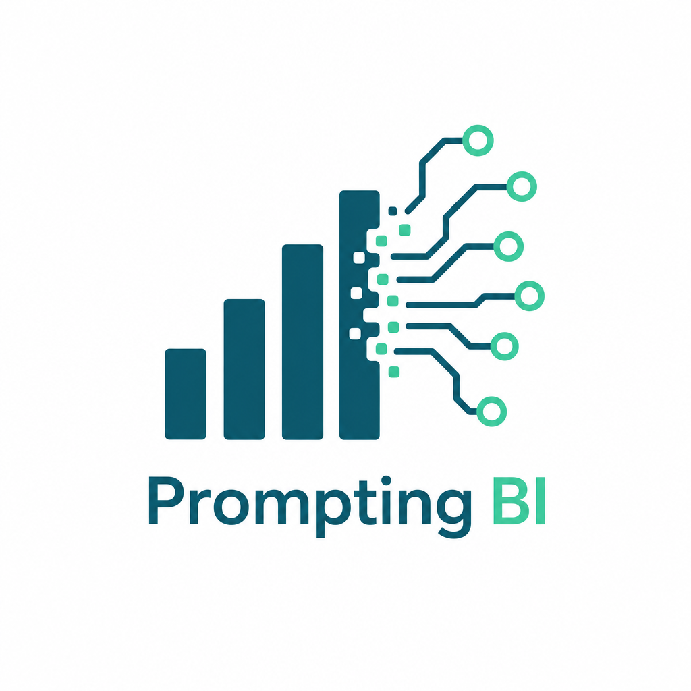

# Prompting BI — Logo Concepts

Private scratch folder. **Not** built or served by Astro (only `public/` ships to the site).
Open this file with Markdown preview to eyeball the options anytime.

## Currently in use

| Light (site header + light favicon) | Dark (dark-mode favicon) |
| --- | --- |
|  |  |

Brain-circuit badge. Light version has transparent corners with a white-filled circle.

## Alternatives

### 1 — PBI monogram

Cleanest at tiny (favicon) sizes and most brand-able. Weakest at signaling *what* the site is about.

### 2 — Bars → circuit

Best story: data (bars) becoming intelligence (circuit/nodes). Busier — would need an icon-only crop for the favicon.

### 3 — Chat bubble + chart

Nails "prompting + BI" fusion, friendly tone. Node cluster competes with the bars at very small sizes.

---

## Notes / TODO
- All files here are AI-generated **raster** PNGs. Whichever direction wins, get a **vector (SVG)** version for crisp scaling and tiny file size.
- For favicons, monogram or an icon-only crop reads best at 16–32px.
