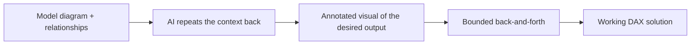

On a conversation on the [podcast I host with 2 fine gentlemen (Explicit Measures Podcast, a lot of fun)](https://www.youtube.com/channel/UCPwPrIpZwlfIKcoUpRwl9OQ) we tend to bring up the intersection of AI & Business Intelligence quite a bit. We know that CoPilot in Fabric is available in a multitude of areas, however tools like ChatGPT seem to be not fully capable of achieving DAX solutions for us.

The answer is obvious: If Generative AI relies on Context, and DAX has it's own Context problems, it becomes very difficult to convey not just the DAX statement you want but also the context of your model that would so help understand the problem and the evaluation context needed. Just like Fabric, all of these AI tools are going through frequent and significant updates on a consistent basis. One that you may not be aware of is OpenAI's visual understanding feature. Feed it an image, ask to explain it, get a pretty scary good answer.

So let's combine the need to feed your model to OpenAI and if ChatGPT can also understand data visualization… Can it? Well, of course it can!

Here is the whole method at a glance. Notice how each step is bounded and confirmed before the next one starts.

### Feeding OpenAI Your Model

The example below demonstrates a series of steps of what I found works incredibly well to get ChatGPT to have the proper context knowing YOUR evaluation context in your model.

We start with feeding a diagram of the model, relationships, and what is important for what you are trying to achieve. I also want ChatGPT to repeat to me that it does indeed understand the model and has the proper context.

It is important when you use any chat based tools, try not to feed too much information at once. You can see from my query here I am explicitly telling ChatGPT not to do any extra work besides evaluate the model and understand the diagram.

This is because these tools WANT to do more, and without the proper guardrails they tend to run like a horse at the races… Provide the necessary guardrails at each step.

From this, ChatGPT gives me back exactly what I need:

Segmented perfection! ChatGPT responds with the information I explicitly asked for, and lets me know we are ready to proceed. Again, context and goals are critical to getting what you want from these tools!

## Visual Help

Now we move to the query of what I need. A tad more complex here, because my visuals are dictating what in DAX I need. So let's use more visuals!

This is where the magic, to me, really is. Not only am I feeding it my desired output, but in my visual I fed it, I have boxed out the user story and what should occur on user interaction. Even in the visual image I sent to ChatGPT, I used SnagIt in the boxes to tell the AI even more context clues. When I mentioned that these tools understand visuals, they are can read and understand text in visuals as well. So in this way I am giving ChatGPT 2 ways of context.

I cannot stress that this method is highly underutilized by most people I work with who are attempting to deploy Generative AI tools at scale. Make it part of your workstream.

## Final Result

After a bit of back and forth with ChatGPT, we have a solution:

In this entire dialogue with ChatGPT I barely had to explain my model expect with the visual diagram, and a visual of the interaction desired.

We also have blocked out to ChatGPT the output at each stage. It is more than OK to tell ChatGPT when to stop, it is actually a great practice to tell ChatGPT (and other tools) not to do more than what is required. That goes into token count and evaluation of the tool itself, but regardless of what tool you are using, it is a good practice to make sure each step of the way you are ensuring "we are on the same page".

## Takeaways

The wonderful thing I appreciate about this blog is no matter what I write on a particular post, it feels as though there are multiple branches of other content that I cannot wait to write about. Just this post, we are skimming the surface on what is possible.

Regardless, from what is covered in this post, you can use the following:

- Segment / Block out your desired output per message to ChatGPT
- Visual Cues are an INCREDIBLE use for ChatGPT, both visual diagramming and visual helpers
- Help out your Gen AI tools by providing context!
